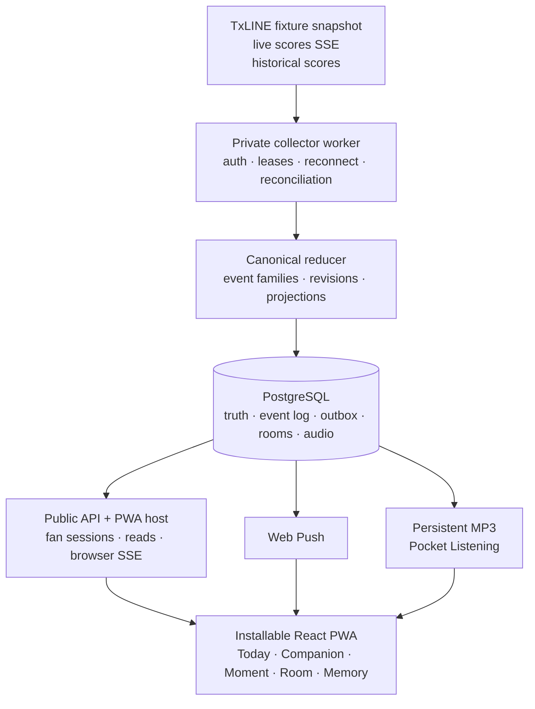

<p align="center">
  
</p>

<h1 align="center">MatchSense</h1>

<p align="center"><strong>Feel the match without watching it.</strong></p>

<p align="center">
  An installable, ambient World Cup companion powered by TxLINE.<br />
  Factual lock-screen alerts, expressive Pocket Listening, honest VAR Moments,
  private Call Three rooms, and full-time Match Memories.
</p>

<p align="center">
  <a href="https://matchsense.up.railway.app"><strong>Open the live PWA</strong></a>
  ·
  <a href="#five-minute-judge-walkthrough">Judge walkthrough</a>
  ·
  <a href="#technical-architecture">Technical documentation</a>
</p>

---

## Submission at a glance

|                           |                                                                                |
| ------------------------- | ------------------------------------------------------------------------------ |
| **Hackathon**             | TxODDS World Cup Hackathon                                                     |
| **Track**                 | Consumer and Fan Experiences                                                   |
| **Live MVP**              | [matchsense.up.railway.app](https://matchsense.up.railway.app)                 |
| **Repository**            | [github.com/18Abhinav07/MatchSense](https://github.com/18Abhinav07/MatchSense) |
| **Primary data source**   | TxLINE World Cup schedule, live scores SSE, and historical fixture scores      |
| **Access**                | No wallet, payment, email address, or third-party account required             |
| **Demo availability**     | A complete five-minute Experience Match is always available inside the PWA     |
| **Demo video and X post** | Published separately with the Superteam submission                             |

## What is MatchSense?

MatchSense is an installable World Cup PWA for moments when a fan cannot keep
the broadcast on-screen: while working, commuting, cooking, exercising, or
using a screen reader.

TxLINE match data is reduced into revision-aware **Moments**. A confirmed goal,
red card, penalty, or final result can trigger a factual operating-system
notification. Tapping it opens the exact event inside MatchSense with the
current score, team-themed visuals, and expressive spoken commentary.

Fans can explicitly activate **Pocket Listening** and continue following one
shared commentary stream while their phone is locked. MatchSense also makes
uncertainty visible: a provisional goal is held during VAR, and an overturned
decision becomes an explicit revision instead of being silently erased.

Before kickoff, friends can create a private **Call Three** room, make three
points-only calls, assign confidence, and react to confirmed events. At
full-time, **Match Memory** preserves the result, decisive Moments, corrections,
and spoken recap.

This is not a sportsbook or a video-streaming service. MatchSense is the
interactive companion layer around the match.

## Why it is different

Most score applications answer one question: _what is the score?_ MatchSense is
designed around a different job: _help me remain emotionally present when I
cannot watch the screen._

- **Ambient, not feed-first.** Audio, push, and a glanceable match surface let a
  fan dip in and out without monitoring a timeline.
- **Truth before theatre.** Score, minute, freshness, and revision render before
  animation, commentary, sponsorship, or friend reactions.
- **VAR is part of the experience.** Anticipation is allowed; an unconfirmed
  event is never presented as a confirmed celebration.
- **Accessible by design.** Spoken updates, factual captions, screen-reader
  semantics, reduced-motion behavior, and team-only fallbacks all consume the
  same canonical event.
- **Social without wagering.** Call Three is a private friend ritual using
  non-transferable MatchSense Points—no stakes, prizes, tokens, or payouts.

## Complete fan journey

```text
INTRO
  → choose a unique handle and favourite team
  → TODAY: live, upcoming, and verified-final fixtures
  → FOLLOW a match and enable factual alerts
  → LIVE COMPANION: score, minute, freshness, and event rail
  → START POCKET LISTENING
  → confirmed TxLINE event
       ├─ foreground full-screen Moment
       ├─ lock-screen Web Push when eligible
       ├─ shared spoken commentary
       └─ private Room update/reaction
  → VAR stands or overturns as a new revision
  → FULL-TIME
  → MATCH MEMORY: result, decisive Moments, audio recap, and replay
```

Fans can also create a Call Three room before kickoff:

```text
CREATE ROOM → share invite → friends join
  → call regulation result, 3+ goals, and 5+ cards
  → assign confidence 3, 2, and 1 once each
  → lock calls at kickoff
  → watch provisional table update from confirmed facts
  → final points after the authoritative final result
```

## Five-minute judge walkthrough

Real matches are not guaranteed to be active during judging, so MatchSense
includes a permanently available Argentina–France Experience Match. It is
clearly labelled **SIMULATED TXLINE-SHAPED DATA** and cannot be mistaken for a
live or recorded TxLINE fixture.

### Solo Experience

1. Open the [live PWA](https://matchsense.up.railway.app) and complete the short
   handle/team onboarding.
2. Select **Enter Experience** from Match Day.
3. Enable alerts. On iPhone or iPad, install the PWA to the Home Screen first.
4. Start the five-minute match and tap **Start Pocket Listening**.
5. Keep the PWA open to see kickoff, goals, cards, penalties, VAR, reconnect
   recovery, and full-time Moments.
6. Lock the phone to test the continuous audio player and standard lock-screen
   media controls.
7. Tap an Experience notification to open its exact current Moment.
8. At full-time, open Match Memory and replay the key Moments with expressive
   audio.

### Friend Room Experience

1. Select **Create a five-minute friend room**.
2. Share the invite with a second browser or device.
3. Both fans make and lock their Call Three selections.
4. Start the Experience, react to confirmed Moments, and watch the points table
   move from provisional to final.

The Experience exercises the same Moment, push, listening, Memory, and Room
contracts used by the real product, while retaining explicit synthetic
provenance.

## Product features

### Match Day and profile

- Anonymous local fan identity with a unique handle
- Favourite-team personalization and team-themed avatar
- Live, upcoming, and archive-verified final fixture sections
- Favourite-team fixtures ordered first
- Deliberate empty/unavailable states instead of fabricated matches or `0–0`
  finals

### Live Companion and Moments

- Score, match minute, last event, lifecycle, and exact freshness
- Database-backed browser SSE with cursor catch-up
- Team-themed goal, card, penalty, VAR, phase, and full-time treatments
- Moment family/revision history for amendments and overturns
- Factual score first, then eligible motion and audio
- Stale/offline states suppress celebration, promotion, and reactions

### Web Push

- Installed-PWA notification registration using VAPID
- Factual title/body that remains useful without opening the app
- Opaque, revision-aware notification resolver
- Warm and cold notification taps open the current canonical Moment
- Invalid subscriptions are retired without exposing endpoints

### Pocket Listening

- Explicit user-gesture activation to satisfy browser autoplay policies
- One continuous MP3 transport for lock-screen media-session continuity
- Commentary generated once per canonical event revision and shared with
  eligible listeners
- Factual text and visual fallback when speech is unavailable
- Authored expressive commentary pack for the five-minute Experience

### Call Three rooms

- Private invite flow and multi-device participation
- Regulation result, 3+ goals, and 5+ cards
- Confidence 3/2/1, used once each
- Save and hard-lock lifecycle before kickoff
- Provisional and final leaderboard
- `ROAR`, `COLD`, and `CALLED IT` reactions tied to a specific Moment revision
- Points only; no money, wallet, odds, prizes, or transferable balance

### Match Memory and recorded replay

- Verified final score and decisive event timeline
- Spoken summary and sequential key-Moment replay
- Revision trail that retains overturned decisions
- Authorised recorded TxLINE archive mode with explicit provenance
- Replay appears only after an eligible archive verifies successfully

## Data modes and provenance

MatchSense never substitutes demo data on a live route.

| Mode           | Provenance                   | What it is allowed to do                                                                                 |
| -------------- | ---------------------------- | -------------------------------------------------------------------------------------------------------- |
| **Live**       | `live_txline`                | Schedule, Live Companion, alerts, Pocket Listening, Rooms, and finalization from realtime TxLINE records |
| **Recorded**   | `recorded_txline_authorised` | Read-only replay and Match Memory from a verified historical TxLINE archive                              |
| **Experience** | `synthetic_txline_shaped`    | Permanently labelled five-minute walkthrough of the consumer contracts                                   |

Historical reconciliation can repair truth and history, but it cannot send a
late “just happened” push or celebration. Only a confirmed realtime delivery is
eligible for those side effects.

## TxLINE integration

### Endpoints used

The private collector uses these TxLINE devnet endpoints:

| Method | Endpoint                                  | Purpose                                                       |
| ------ | ----------------------------------------- | ------------------------------------------------------------- |
| `POST` | `/auth/guest/start`                       | Create or renew the guest JWT                                 |
| `GET`  | `/api/fixtures/snapshot?competitionId=72` | World Cup fixture discovery and schedule synchronization      |
| `GET`  | `/api/scores/stream`                      | Realtime score and match-event delivery over SSE              |
| `GET`  | `/api/scores/historical/{fixtureId}`      | Ordered fixture recovery, reconciliation, archive, and replay |

The TxLINE API token and guest JWT exist only in the private worker. They are
never included in the PWA bundle, service worker, or public API configuration.

### What worked especially well

The combination of stable fixture identifiers, source sequence/timestamps,
realtime SSE, and per-fixture historical records made it possible to build one
event model across live following, reconnect, replay, and Memory.

During the historical validation spike, one eligible fixture returned 1,027
ordered source records, including 154 canonical football records and an
authoritative `game_finalised` record. Two clean reductions produced identical
results, and re-ingestion produced no new canonical outcomes. That gave us a
strong foundation for deterministic replay rather than an authored highlight
list.

### Where we hit friction

- Authentication requires an API token, guest JWT, `401` renewal, and strict
  network/environment alignment. We isolated this lifecycle in a backend-only
  authenticated client.
- Consumers must distinguish football actions from coverage, lifecycle, and
  telemetry records. MatchSense retains source-only deliveries but prevents
  them from becoming fan Moments.
- Historical decoding needs to tolerate the documented/observed SSE encoding
  and JSON-array form while retaining order and deduplicating reconnects.
- Score/stat snapshots can be partial, and player identity can be absent. The
  UI therefore guarantees a team-level Moment and never invents a scorer.
- More explicit end-to-end examples for VAR amendments, repeated phase
  markers, partial score shapes, player-null goals, stream retention, and
  `Last-Event-ID` resumption would reduce integration time.

An official TypeScript SDK covering authentication renewal, typed football
actions, reconnect/resume, and fixture discovery would make TxLINE’s excellent
normalized data model easier to operate in production-shaped consumer apps.

## Technical architecture



### Service ownership

MatchSense runs one codebase in two explicit Railway roles:

- **`ROLE=worker`** owns TxLINE credentials, schedule sync, historical
  reconciliation, the fenced upstream SSE lease, canonical reduction,
  commentary jobs, Room projection, and the durable outbox.
- **`ROLE=api`** serves the built PWA, anonymous fan sessions, database-backed
  reads, browser SSE, Web Push registration, Room mutations, replay, and the
  persistent listener transport. It is forbidden from receiving the TxLINE
  token or VAPID private key.

PostgreSQL is the durable truth, queue, archive, and commentary cache. The
browser is never trusted to finalize a result, settle a Room, or reconstruct
missed history.

### Truth and side-effect contract

An accepted source delivery commits its normalized event, projection, Moment
revision, browser sequence, and outbox work atomically. Only after that commit
can external behavior occur.

```text
TxLINE delivery
  → validate and retain source identity
  → deduplicate / reject / quarantine / normalize
  → append event-family revision
  → update canonical fixture projection
  → commit browser event + outbox work
  → then broadcast, push, speak, react, score, or finalize Memory
```

Five identities remain deliberately separate:

1. Source delivery key
2. Football event-family key
3. Visible Moment revision
4. Fixture browser sequence
5. Room settlement revision

That separation prevents a reconnect duplicate from becoming a second goal,
an amendment from erasing history, or a stale notification from replaying an
overturned celebration.

## PWA and device behavior

- The PWA works as a normal responsive website before installation.
- iOS/iPadOS Web Push requires installation to the Home Screen and a direct
  permission action from the fan.
- Android and supported desktop browsers use their native install and
  notification surfaces.
- The operating system controls notification layout, sound, timing, and
  lock-screen placement.
- Pocket Listening needs one direct tap before the browser permits audio.
- Standard media-session controls may appear on the lock screen; MatchSense
  does not claim native Live Activities or custom Dynamic Island UI.
- If audio, push, vibration, or motion is unavailable, the factual score and
  caption remain the primary experience.

## Commercial and monetization path

The hackathon build contains the consumer surfaces and truth rules required for
commercial inventory; payment processing and a campaign-management dashboard
are roadmap items, not features claimed as deployed.

### Monetization Brain

A future campaign-policy engine can decide whether a confirmed Moment is
eligible for promotion:

```text
confirmed canonical Moment
  → stream fresh and reconciled?
  → VAR clear?
  → suitable for the fan's team perspective?
  → campaign eligible for fixture/event/region?
  → frequency cap available?
  → show a labelled placement or suppress it
```

Non-negotiable commercial rules:

- The football fact is complete before the promotion begins.
- Promotions never appear during provisional VAR, stale data, reconnect, or an
  overturned event.
- A sponsor cannot change commentary facts, score, event order, or Room points.
- Paid placements are labelled and contextually targeted without selling
  private fan data.
- No fictional brand is presented as a real MatchSense partner.

### Revenue products

1. **Sponsored confirmed Moments** — short branded signatures after eligible
   goals, penalties, half-time, full-time, and Match Memory.
2. **Paid match-day promotions** — branded celebration themes, Call Three
   questions, recap frames, and promoted community watch parties.
3. **Premium Watch Parties** — larger private rooms, ad-free use, custom themes,
   expanded calls and polls, group Memories, richer host controls, and
   tournament-long friend tables via a match pass or subscription.
4. **White-label licensing** — license Moments, Pocket Listening, Web Push,
   Rooms, and Memory to broadcasters, clubs, publishers, and sports apps.

Premium Watch Parties remain companion experiences. MatchSense does not
redistribute the match broadcast.

## Judging-criteria fit

| Criterion                          | MatchSense evidence                                                                                                                   |
| ---------------------------------- | ------------------------------------------------------------------------------------------------------------------------------------- |
| **Fan Accessibility & UX**         | Installable, zero-wallet PWA; team personalization; audio, captions, reduced-motion behavior, and screen-reader-friendly structure    |
| **Real-Time Responsiveness**       | TxLINE SSE collector, durable canonical reduction, browser cursor catch-up, Web Push, Moments, commentary, and Room projection        |
| **Originality & Value Creation**   | Ambient “feel the match” interaction model combining locked-phone listening, exact Moments, honest VAR, social calls, and Memory      |
| **Commercial & Monetization Path** | Sponsored confirmed Moments, paid promotions, premium watch parties, and white-label licensing governed by truth-first campaign rules |
| **Completeness & Execution**       | Onboarding → Match Day → Companion → Moment → Push/audio → Room → final Memory, plus an always-available five-minute walkthrough      |

## Technology stack

- React 19 and Vite 8
- TypeScript with strict package boundaries
- Node.js 24 and Fastify 5
- PostgreSQL 17-compatible persistence
- Server-Sent Events
- Web Push with VAPID
- Gemini/Groq-assisted commentary and TTS with deterministic fallbacks
- FFmpeg-normalized continuous MP3 audio
- Railway API, worker, and PostgreSQL deployment
- Vitest, Node test runner, integration tests, and container smoke tests

## Repository map

```text
apps/
  web/                 React PWA and service worker
  server/              API role, collector role, audio, push, Rooms, replay
packages/
  commentary/          Commentary text and speech contracts
  contracts/           Shared schemas and boundary types
  db/                  PostgreSQL migrations and repositories
  event-engine/        Canonical event and projection rules
  moment-engine/       Fan-facing Moment derivation
  replay/              Deterministic replay contracts
  rooms/               Call Three domain rules
  txline-adapter/       TxLINE auth, schedule, SSE, history, normalization
  ui/                  Shared presentation boundaries
scripts/               Smokes, asset checks, and operational tools
```

## Run locally

### Requirements

- Node.js 24 or newer
- pnpm 11.13.0
- PostgreSQL 17-compatible database
- A valid TxLINE hackathon API token for the worker's live-data path

### Install and verify

```sh
corepack enable
corepack prepare pnpm@11.13.0 --activate
pnpm install --frozen-lockfile
pnpm test
pnpm typecheck
pnpm build
pnpm asset:check
```

Copy `.env.example` into your preferred local environment loader and configure
the variables for the process role. Never commit credentials.

### API role

```sh
DATABASE_URL=postgresql://...
ROLE=api
DATA_RIGHTS_MODE=txline_hackathon
```

To enable push registration on the API role, also provide
`VAPID_PUBLIC_KEY` and `PUSH_SUBSCRIPTION_ENCRYPTION_SECRET`. Do not provide the
TxLINE token or VAPID private key to this role.

### Worker role

```sh
DATABASE_URL=postgresql://...
ROLE=worker
DATA_RIGHTS_MODE=txline_hackathon
TXLINE_API_TOKEN=...
```

Web Push delivery additionally requires `VAPID_SUBJECT`, `VAPID_PUBLIC_KEY`,
`VAPID_PRIVATE_KEY`, and `PUSH_SUBSCRIPTION_ENCRYPTION_SECRET`. `GROQ_API_KEY`
and `GEMINI_API_KEY`/`GOOGLE_API_KEY` are optional commentary enhancements.

Run each process in its own terminal:

```sh
pnpm --filter @matchsense/server dev
```

The same server package reads `ROLE` and starts only the requested process.

## Railway deployment

The root [`Dockerfile`](Dockerfile) builds the entire pnpm monorepo and produces
one image. [`railway.json`](railway.json) contains the shared Docker/lifecycle
contract. Configure two services from that image:

| Service                | Role     | Start command        | Health check                |
| ---------------------- | -------- | -------------------- | --------------------------- |
| `matchsense`           | `api`    | `node dist/entry.js` | `/health/ready`             |
| `matchsense-collector` | `worker` | `node dist/entry.js` | private long-running worker |

Railway PostgreSQL provides the private `DATABASE_URL`. The API serves both the
PWA and `/api` routes from one origin, which is required for cookies, push
activation, SSE, and installable-PWA routing.

## Verification evidence

The repository contains automated coverage for:

- TxLINE authentication, schedule parsing, fragmented SSE, `401` renewal,
  reconnection, historical recovery, deduplication, and fatal source states
- Canonical score, card, VAR, correction, and finalization behavior
- Browser snapshot/cursor catch-up and exact Moment resolution
- Web Push payload, registration, delivery, cold/warm activation, and stale-tap
  reconciliation
- Persistent listening sessions, MP3 stream compatibility, and commentary
  artifact fan-out
- Call Three create/join/save/lock/react/project/finalize/recovery lifecycle
- Match Memory and recorded replay
- PWA routes, manifest, service worker, container boot, and health endpoints

Physical acceptance completed on an installed iPhone PWA for Experience Pocket
Listening, standard lock-screen media controls, Web Push receipt, notification
tap, and exact Moment activation. A production two-fan session also completed
follow → create → share → join → save → lock for a real scheduled fixture.

The latest expressive-audio replacement passed 52 focused
audio/runtime/Memory tests, server typecheck, the full monorepo build, and asset
rights validation before deployment.

## Security, privacy, and integrity

- TxLINE and VAPID private credentials remain worker-only.
- Stored push subscriptions are encrypted separately from VAPID signing keys.
- Fan mutations use anonymous server sessions and CSRF protection.
- Source ordering, Moment revision, commentary, push, reaction, and Room scoring
  are idempotent.
- Historical/reconciliation delivery is not allowed to masquerade as realtime.
- MatchSense does not require a crypto wallet and implements no financial flow.
- Assets and generated audio are recorded in
  [`ASSET-LICENSES.md`](ASSET-LICENSES.md).

## Honest boundaries

- Web Push is controlled by the browser and operating system; provider
  acceptance does not prove that a fan saw or heard an alert.
- iOS/iPadOS push requires an installed Home Screen PWA.
- MatchSense does not claim native Live Activities, custom notification chrome,
  or programmable Dynamic Island UI.
- Player identity is shown only when it is explicitly supplied and validated;
  the guaranteed fallback is team-level.
- Real fixtures appear only when source-qualified. Unavailable matches and
  unverifiable final records are omitted rather than fabricated.
- Experience data is synthetic and permanently labelled. Recorded data is
  authorised TxLINE history and permanently labelled. Neither is presented as
  live.
- Payment processing, campaign management, and premium billing are commercial
  roadmap items, not deployed hackathon features.

## Team and ownership

MatchSense is submitted and owned by Abhinav
([@18Abhinav07](https://github.com/18Abhinav07)). Product decisions, device
acceptance, narration, submission, and prize eligibility remain human-owned.

---

**TxLINE supplies the facts. MatchSense turns every fact into a Moment each fan
can feel.**
